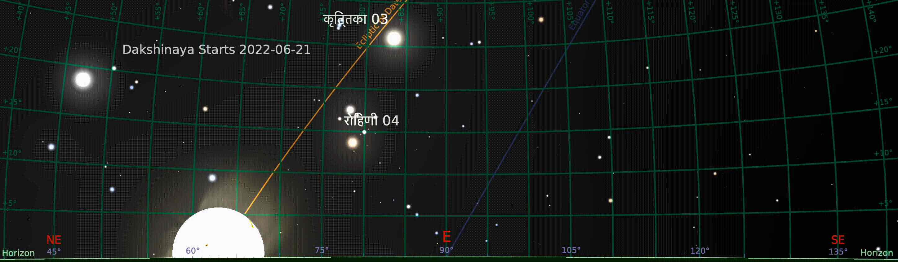
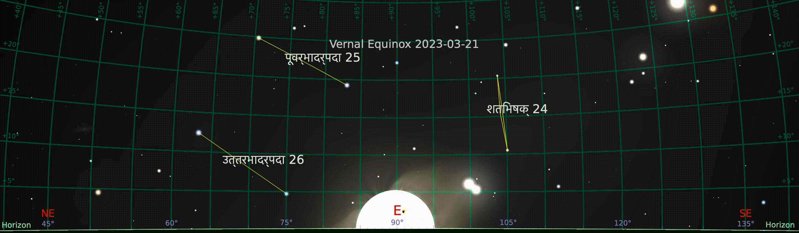
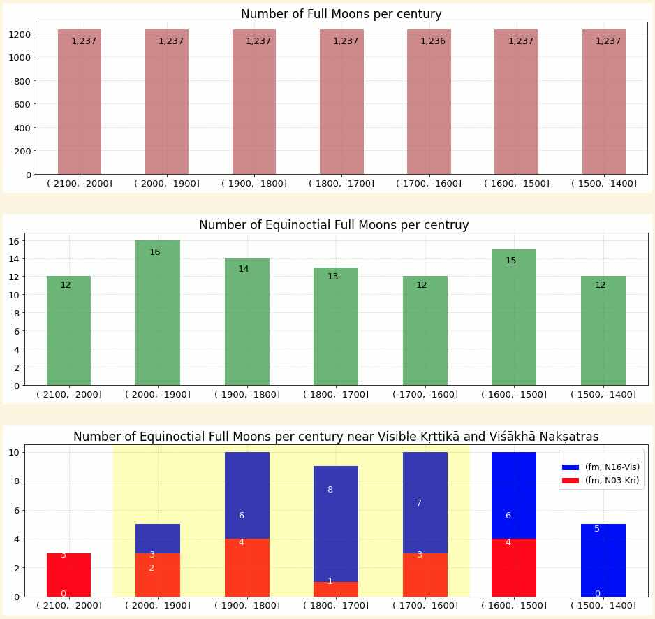
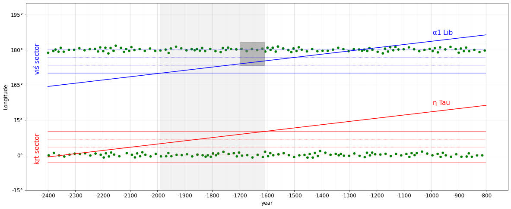
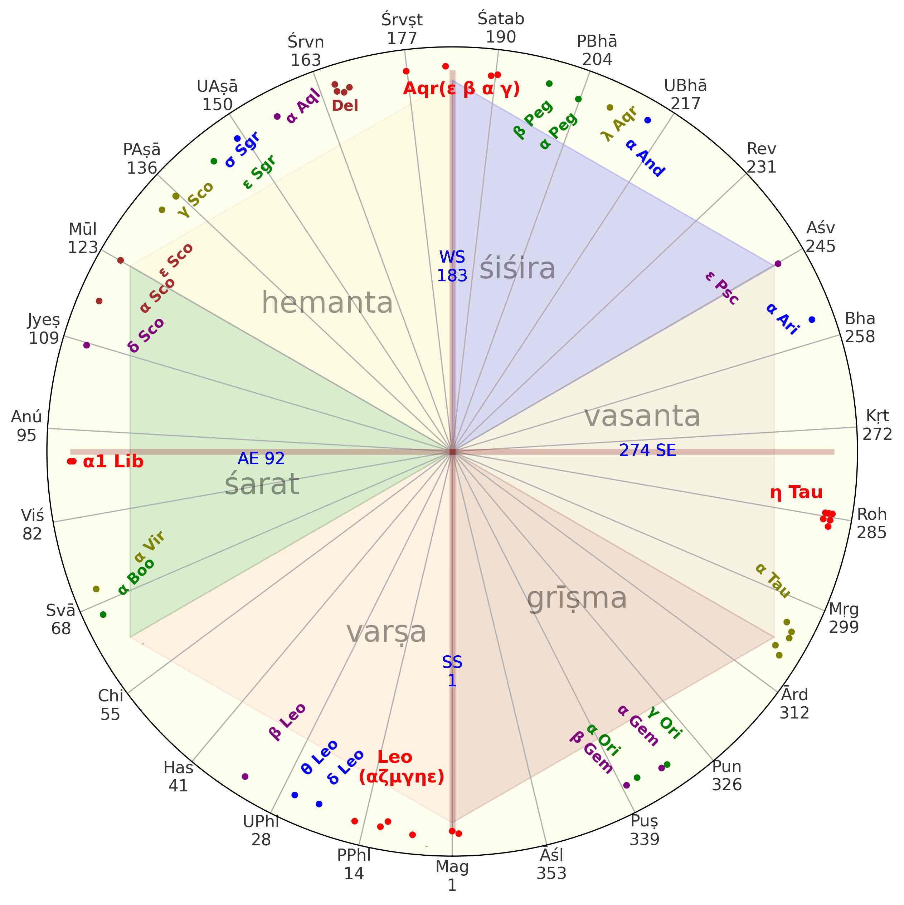
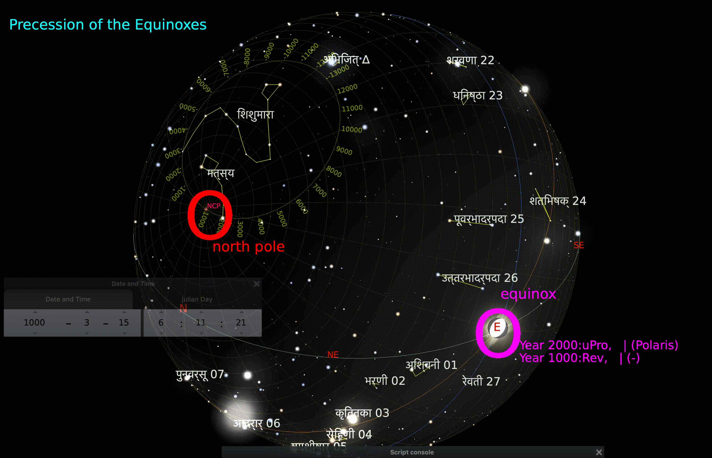
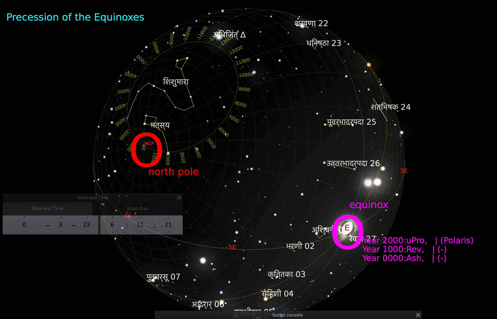
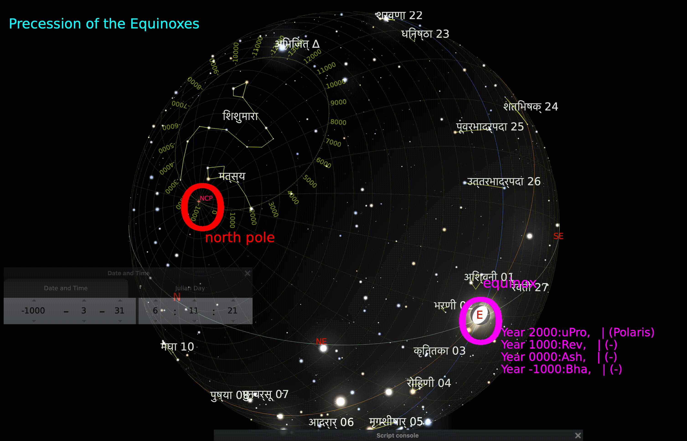

<!-- # Solar Transits in   pre-Common-Era Texts  &   their Dating using   the precession phenomenon -->
# Theme 3.2     Nakṣatra Solar zodiac from Vedic times    Dating Maghādi and Śraviṣṭhādi Epochs

---

<!-- 

 

 -->

## Observing the Sun's rhytmns

### ( [ayana](https://cahc.jainuniversity.ac.in/assets/talks/bihs/sun-transit/sun-transit-ayana.gif), ṛtu, nakṣatra, [precession](https://cahc.jainuniversity.ac.in/assets/talks/bihs/sun-transit/sun-transit-precession.gif) )

|view of sunrise | surise location|sunrise (day) count|
|--|:--:|:--:|
|| north east|1|
| | true east|92|
| | south east|183|
| | true east|274|
| | north east|367    1 of next cycle|

- The sunrise horizon point moves from north east to south east and back to same north east point after 366 sunrises - a solar year.
- The north east to south east journey is called **dakṣiṇāyana** and the reverse is  **uttarāyaṇa**
- In addition the sun cycles through six ṛtu-s in a year - **śiśira, vasanta, grīṣma, varṣā, śarad, hemanta** - each of 61 sunrises.
- Specific background stars can be observed just before each sunrise. These stars are called **nakṣatra-s** , 27 in number.
- Each of the 2 ayana-s and 6 ṛtu-s are associated with specfic nakṣatra-s.
- Over ages this ayana/ṛtu-nakṣatra association changes due to the **precession** phenomenon. 
- This change is used to date the ancient texts.

---

## Nakṣatra solar zodiac

- The **Sun** completes one circuit in **366 days** in **clockwise** direction  
- The **ṛtu-s** complete one circuit in ~**25,800 years** in **anticlockwise** direction

-

---

## The Maghādi/dakṣināyaṇa epoch

### [Brahmāṇḍa Purāṇa *BP 21.143-149*](https://raw.githubusercontent.com/cahcblr/sanchaya/main/Puranani/brahmanda%20purana.txt)

- This BP passage defines visuvat to be of equal day and night duration of 15 muhūrtas each - equinox - in the mid of vasanta and śarat ṛtus.

- The passage further states the nakṣatra location at an aṃsa grain for equinoctal sun and moon at spring and autumn equinoxes.

- It turns out the sun and moon locus at each of the equinox are diametrically opposite - at 1/4 kṛttikā and  3/4 viśākhā,  indicating the description are of the **equinoctial full moon**. 

|||
|--|--|
| **शरद्वसंतयोर्मध्ये मध्यमां गतिमास्थितः । अतस्तुल्यमहोरात्रं करोति तिमिरापहः ॥** | In *mid autumn and spring* having attained moderate pace, *the sun*, remover of darkness, therefore *makes day and night equal*. 
| हरिताश्च हया दिव्यास्तस्य युक्ता महारथे । अनुलिप्ता इवाभान्ति पद्मरक्तैर्गभस्तिभिः ॥ | The divine yellow horses, yoked to his great chariot, shine like covered with the lotus-red rays.
| मेषान्ते च तुलान्ते च भास्करोदयतः स्मृताः । **मुहूर्त्ता दश पञ्चैव अहो रात्रिश्च तावती** ॥ | The hours of the day and night are each reckoned as ten and five muhūrtas from the rising of the sun at the end of meshā and tulā
| **कृत्तिकानां यदा सूर्यः प्रथमांशगतो भवेत् । विशाखानां तदा ज्ञेयश्चतुर्थांश निशाकरः** ॥  | When the *sun is in the first part of kṛttikā*, know the *moon is in the fourth part of viśākhā*
| **विशाखानां यदा सूर्यश्चरतेंशं तृतीयकम् । तदा चन्द्रं विजानीयात्कृत्तिकाशिरसि स्थितम्** ॥ | When the *sun is in the third part of viśākhā*, know the *moon is in the head of kṛttikā*
| विषुवं तं विजानीयादेवमाहुर्महर्षयः । सूर्येण विषुवं विद्यात्कालं सोमेन लक्षयेत् ॥ | It is then understood to be equinox - so say the maharishis. Equinox is known through the sun and time by the moon
| समा रात्रिरहश्चैव यदा तद्विषुवं भवेत् । तदा दानानि देयानि पितृभ्यो विषुवेषु च ॥ | *When equinox occurs, night and day are equal*. Then during equinoxes offerings are made to piṭṛs 

---

### [Maitrāyaṇīya Āraṇyaka Upaniṣat *MAU 6.14*](https://github.com/cahcblr/sanchaya/blob/647880cd98978d739d122a9a6b7069a4d56c6f3d/Vedic%20texts/YV/MAU-text.txt#L2)

- The year commences in Maghādi (at dakṣiṇāyana).
- A year has 12 parts and each part has 9 amṣa.
- The year's first half , Āgneya,is from **Maghādi** to Śraviṣṭhārdha and 
- The second half , Vāruṇa, is from Sārpādi to Śraviṣṭhārdha in reverse order.

|||
|--|--|
|सूर्यो योनिः कालस्य तस्य एतद्रूपं । | Sun and Time are contemporaries
|यन्निमेषादि कालात्संभृतं द्वादशात्मकं वत्सरम् । | वत्सरः(year) has 12 parts and   is filled with time units starting with निमेषा(eye wink)
|एतस्याग्नेयमर्धमर्धं वारुणम् । | Year's first half is आग्नेयः(Āgneya) and  the second half is वारुणः(Varuṇa)
| **मघाद्यं** श्रविष्ठार्धमाग्नेयं क्रमेणोत्क्रमेण सार्पाद्यं श्रविष्ठार्धान्तं सौम्यम् ।  | *Āgneya - from मघादि (Maghā start) to श्रविष्ठार्धः(half of Śraviṣṭhā)*   Varuṇa - from सार्पादि(Sārpā start) to श्रविष्ठार्धान्तः(end of half of Śraviṣṭhā) in counter order
|तत्र एकमात्मनो *नवांशकं* सचारकविधम् । | In each part, the Sun traverses 9 amṣa( portions) in order  **9 amṣa(portion) for each of the 12 year parts implies each nākshatra has 4 amṣa** 

<!--  -->

### [Nidānasūtra  *NS 5.12*](https://archive.org/details/in.ernet.dli.2015.408135/page/n173/mode/2up?view=theater)
- Sun traverses 13 and an additional 5/9 ahorāṭras in each nakṣatra. 
- To cover 27 nakṣatras the sun takes 366 ahorāṭras/days. 

|||
|--|--|
स एष नाक्षत्रः आदित्यसंवत्सरो । *सः एषः नाक्षत्रः आदित्यसंवत्सरः ।* | This is the nakṣatra year of the sun
आदित्यः खलु शश्वदेतावद्भिरहोभिर्नक्षत्राणि समवैति । *आदित्यः खलु शश्वत्  एतावत्भिः अहोर्भिः नक्षात्राणि समवैति ।* | The sun, indeed, with these many days, stays with each nakṣatras
त्रयोदशाहं त्रयोदशाहमेकैकं नक्षत्रमुपतिष्ठति। *त्रयोदशाहं त्रयोदशाहम  एकैकं नक्षत्रम् उपतिष्ठति ।* | The sun spends **13 days** with each nakṣatra  
अहस्तृतीयं च नवधा कृतयोरहोरात्रयोर्द्वे द्वे कले चेति संवत्सराः। *अहः तृतीयं च नवधा कृतयोः अहोरात्रयोः  द्वे द्वे कले चेति संवत्सराः ।* | अहोरात्रि/3 + (2* अहः +  2* रात्रि)/9 =  **5 अहोरात्रि/9**  *13 and 5/9 days with each nakṣatra*
ताश्चत्वारिंशच्चतुःपञ्चाशतं कलाः। *ताः चत्वारिंशत् चतुःपञ्चाशतं कलाः ।* | ???? Those are 40 and/times 54 kalās
ते षण्णववर्गाःसषट्षष्टित्रिशतः ॥ *ते षट् नव वर्गाः सः षट्षष्टिः त्रिशतः ॥* | ???? These are 6*9 vargās and 366

---

## From these MAU, NS and BP passages

1. Sun spends *13 and 5/9 days equally* with each naḳsatra of 4 amṣa . The sun completes one trip through the 27 nakṣatras in 366 days
2. The *sun is at Maghādi at start of dakṣiṇāyana*. (Further Mahāsaliaṃ chapter of Vṛddagārgīya Jyotiṣa (VGJ) states Maghā to be the first among the solar nakṣatras.) 
3. The equality of the 27 nakṣatras and the start of sequence at at Maghā help allocate the day numbers to each nakṣatra sector.
4. *The **BP** verses specify the spring and autumnal equinoctial full moons at 1/4 Kṛttikā and 3/4 Viśākhā nakṣatras. This information enables us to date the verses.*
5. We mark the **Kṛttikā and Viśākhā sectors** such that equinoxes are at ¼ kṛttikā and ¾ viśākhā. 
6. We collect the **visible Kṛttikā(η Tau) and Viśākhā(α Lib)** longitudes adjusted for precession from 2400BCE to 0BCE.
7. We programatically collect all full moon longitudes that occur near the equinoxes from 2400BCE to 0BCE, using astropy library. There are about 7 such events each century for each equinox. *The **equinoctial full moons** are marked in the chart that follows.*
---

## A tech note  - Collecting full moons programatically

The **Astropy** library, that uses **Meeus algos**, is used to collect the full moon longitudes **programmatically**.

1. Start at an ancient date - 2400-03-21 BCE
2. Computed the full moon longitude for the date
3. If sun and moon longitudes are within 180°+ $\epsilon$ 
  -- a FM found, collect it
  -- step up the date by 28 days and repeat
1. If not nudge the date by difference of sun and moon longitudes  
2. Repeat 2 onwards till 0 BCE

**Meeus, J., Astronomical Algorithms, 2nd ed, p337, p357**

$\lambda_{moon} = 218.3164477+481267.88123421T$ 

$-0.0015786T^2$

$+ \frac{1}{538,841}T^3$ 

$- \frac{1}{65,194,000}T^4$

$+ \frac{1}{1{,}000{,}000}\sum l$

$T = \frac{FMJD - 2451545.0}{36525}$

$FMJD$ is Julian Day number of Full Moon

---   

## Computing the information of BP

- Get full moon timeseries from 2400BCE to 800BCE. There are about *1237 FM per century - the top chart*    
- The series is then filtered for *Equinoctial Full Moons - the mid chart*     
- The series is further filtered for *EFM near kṛttikā and viśākhā - the bottom chart*
- The *yellow region* shows the epoch when the visible kṛttikā and viśākhā are contained in their respective sectors - **2000BCE to 1600BCE**
<!-- -  $$\lambda = L' + \frac{\sum l}{1{,}000{,}000};  \beta =  \frac{\sum b}{1{,}000{,}000}$$ -->
<!-- $$\lambda = 218.3164477+481267.88123421T -0.0015786T^2$$ 
$$+ \frac{1}{538841}T^3 - \frac{1}{65194000}T^4 + \frac{\sum l}{1{,}000{,}000}$$ -->

---   

## Inferring the BP epoch

||
|--|

|||
|--:|:--|
Axes | BCE years on the x-axis and longitudes/nakṣatra sectors on the y-axis
Green Dots | **Equinoctial Full Moons**  
Red Sector | Extent of **Kṛttikā sector** containing SE *(Sun at 0°)* in its 1st amśa
Blue Sector | Extent of **Viśākhā sector** containing AE *(Sun at 180°)* in its 3rd amśa
Sloping Red/Blue| **Visible Kṛttikā/Viśākhā longitudes** adjusted for *precession*
Light Gray Band | Epoch when  **visible Kṛttikā/Viśākhā** are in **their respective sectors** ~*1980-1610 BCE*
Dark Gray Band| Epoch for **AE FM at 4th amśa of Viśākhā closest to visble Viśākhā** ~*1700-1610 BCE*

|||
|--|--|
**1980-1610 BCE** | The *visible Kṛttikā & Viśākhā* are *contained in their respective sectors* 
**1700-1610 BCE** | The equinoctial *FM  at ¾ viṣākhā sector is nearest to visible viśākhā* 
**Maghādi scheme** | The Maghādi scheme of MAU is consistent with the equinoctial full moon scheme of BP

---

## Nakṣatra Chart 1700BCE  - Maghādi epoch

- The *equinoctial full moons of BP*
  - ¼ kṛttikā sector
  - ¾ viśākhā sector
  - SE-AE axis of the chart
- *aligns with maghādi of MAU*
  - when maghādi (SS 1) is at 
    - start of dakṣiṇāyana
- *around 1700 BCE*

<!-- Computatonally, the alignment is found to be
  - when the visible kṛttikā and viśākhā are 
    - *contained in their respective sectors*
  - when the equinoctial full moon at 
    - ¾ viśākhā sector is 
    - nearest to visible viśākhā -->
  

---

## The Śraviṣṭhādi/uttarāyaṇa epoch - VGJ/11 Ādityachāra and Parāśharatantra

- Ādityachāra, section 11 of VGJ, describes the transit of Sun through 9 seasonal nakṣatras . 
- Similar information is presented in PT in prose.
- The Ādityachāra passage is shown below.
- Passage maps 6 ṛtus mapped to 9 seasonal nakṣatras  
- Mapping enables passage dating

|Verse|From|To|Ṛtu|Span|
|:---|:---:|:---:|:---:|:--:|
**श्रविष्ठादीनि** चत्वारि **पौष्णार्धञ्च*** दिवाकरः  ।   वर्धयन् सरसस्तिक्तं मासौ तपति **शैशिरे**  ॥ 47 | श्रविष्ठा begin | रेवती mid | शिशिर | 270°-330° |
**रोहिण्यन्तानि** विचरन् **पौष्णार्धाद्याच्च** भानुमान् ।  मासौ तपति **वासन्तौ** कषायं वर्धयन् रसम्॥ 48 | रेवती mid | रोहिणी end | वसन्त|330°-30°|
**सार्पार्धान्तानि** विचरन् **सौम्याद्यानि** तु भानुमान् ।  **ग्रैष्मिकौ** तपते मासौ कटुकं वर्धयन् रसम्॥ 52 | मृगशिरा begin | आश्लेषा mid | ग्रीष्म| 30°-90°|
**सावित्रान्तानि** विचरन् **सार्पार्धाद्यानि** भास्करः ।  **वार्षिकौ** तपते मासौ रसमम्लं विवर्धयन्॥ 53 |आश्लेषा mid | हस्ता end | वर्षा| 90°-150°|
**चित्रादीन्यथ** चत्वारि **ज्येष्ठार्धञ्च** दिवाकरः।  **शारदौ** लवणाख्यं च तपत्याप्याययन् रसम्॥ 54 | चित्रा begin | ज्येष्ठा mid | शरद्|150°-210°|
**ज्येष्ठार्धादीनि** चत्वारि **वैष्णवान्तानि** भास्करः ।  **हेमन्ते** तपते मासौ मधुरं वर्धयन् रसम् ॥ 55 | ज्येष्ठा mid | श्रवण end | हेमन्त|210°-270°|

  

---

## Dating Ādityachāra - by minimizing error

- The **best fit method** finds the epoch where most stars of *nakṣatra-s* are in their prescribed span
	- Get longitude of 83 stars from -2500 to 500 in 50 year epoch steps
	- For each epoch compute this error metric **$\mathbb{E}_{epoch}$**
	- The epoch with **lowest error metric** is the best fit **$\mathbb{B}_{epoch}$**

-   The error metric for each epoch **$\mathbb{E}_{epoch}$** is calculated as the mean of the containment error of each nakshatra. The containment error for each nakshatra is calculated as the mean of eachs star's error. The error for each star is calculated as follows:

    - If the longitude of the star is within the prescribed span of the nakshatra, the error is 0.
    - Otherwise, the error is the minimum distance between the longitude of the star and the boundaries of the prescribed span of the nakshatra.
  
<!-- $$ 
\begin{aligned}
\mathbb{B}_{epoch} &= \mathop{\arg \min}\limits_{ {epoch} {} \in -2500,500,50} \mathbb{E}_{epoch} \\
\mathbb{E}_{epoch} &= \frac{1}{27}{\sum_{न=1}^{27} \frac {\sum_{त=1}^{T_{न}} err_{न,त}} {T_{न}}} \\
  err_{न,त} &= \begin{cases}
    0, & \text{if  {}  $long_{न} \lt long_{त}< long_{न+1}$}  \\ 
    else & min(\bigl| long_{त} - long_{न}\big| , | long_{त} - long_{न+1}\big|)  
  \end{cases}
\end{aligned}
$$ -->

---

## The Śravaṇādi epoch  VGJ/59 Ṛtusvabhāva

- Ṛtusvabhāva dates to **~500 BCE**
 
- This is different from आदित्यचारः
	- Ṛtu sequence begins with वसन्त not शिशिर
	- Ṛtu are related to months, not  *nakṣatra* span & boundaries
	- A 12 month **solar zodiac**, obviating intercalation, emerges
 
- It describes Sun's path through
	- 6 seasons and their months
	- 12  **vaidika** and equivalent **laukika** months and  12  *nakṣatra-s* for each of these months - ~30° apart

---

## A chronology of Solar transits  

|Epoch|Scheme|Start|Season|
|--:|:--:|--:|--|
earlier | **2 Ayana/6 Ṛtu** based sun transit   |
1800 BCE | **MAU/BP**  Equinoctial full moon scheme | Maghādi |dakṣināyaṇa 
1300 BCE  | **VGJ/ādityacāra** and **PT**  with *4½ nakṣatra-s* per season | Śraviṣṭhādi |uttarāyaṇa
500 BCE  | **VGJ/ṛtusvabhāva**  with *12 solar months* | Śravaṇādi  *Revatyādi Bharaṇyādi*| uttarāyaṇa  *vasanta spring equinox*

**Solar zodiac** is certainly part of original Indian knowledge - that has been recorded and evolved over time.

---

## References

|  | |
|---:|---|
1|**Abhyankar, K. D. (1991)**[Misidentification of some Indian nakṣatras. Indian Journal of History of Science, 26(1), 1–10.](https://github.com/suchakr/cahc-utils/blob/main/papers/naks/naks-1991-abyn-misidentified-naks.pdf)
2|**Das P. (2018)** [Bhāgavata Cosmology; Vedic Alternative to Modern Cosmology, Tulsi Books, Mumbai.](https://tulsibooks.com/product/bhagavata-cosmology-vedic-alternative-to-modern-cosmology/)
3|**Gondalekhar, P. (2013)** [The time keepers of the Vedas. Manohar. [ISBN 978-81-7304-969- 9].](https://www.amazon.in/Time-Keepers-Vedas-History-Calendar/dp/8173049696)
4|**Iyengar, R. N. (2013)** [Parāśara Tantra (Ed. Trans & Notes). Jain University Press. [ISBN 978-81-9209-924-8].](https://www.amazon.in/Time-Keepers-Vedas-History-Calendar/dp/8173049696)
5|**Iyengar R.N. (2016)** Astronomy in Vedic texts,(Book Chapter pp.107-169). History of Indian Astronomy A Handbook, (Ed. K.Ramsubramanian, A.Sule &M. Vahia)  Publn. by IITB and TIFR, Mumbai.
6|**Iyengar R.N. and  Chakravarty, S (2023)** [Equinoctial full moon of the Brahmāṇḍa Purāṇa and the nakṣatra](http://cahc.jainuniversity.ac.in/assets/ijhs/rni-maghadi-2023.pdf)
7|**Iyengar R.N. and  Chakravarty, S (2021)** [Transit of sun through the seasonal nakṣatra cycle in the Vṛddha‐Gārgīya Jyotiṣa, Indian Journal of History of Science 56:159–170.](https://github.com/suchakr/cahc-utils/blob/main/papers/vgj/vgj-2022-01-rni-sc-sun-transit.pdf)
8|**Koch D. (2014)** [Astronomical dating of the Mahābhārata war. Erlenbach, Switzerland](https://www.gilgamesh.ch/KochMahabharata6x9_V1.00.pdf)
9|**Sastry T. S. K. (1984)** [Vedāṅga Jyotiṣa of Lagadha. Indian Journal of History of Science, 19 (4), l–74.](https://github.com/suchakr/cahc-utils/blob/main/papers/lvj/lvj-1984-kuppanna.pdf)
10|**Sengupta, P. C. (1947)** [Ancient Indian Chronology. Univ. of Calcutta.](https://indianculture.gov.in/ebooks/ancient-indian-chronology-illustrating-some-most-important-astronomical-methods)
11|**Srinivas M.D. (2019)** [The Untapped Wealth of Manuscripts on Indian Astronomy and Mathematics Indian Journal of History of Science, 54.3, 243-268.](https://www.researchgate.net/profile/M-Srinivas/publication/336438227_The_Untapped_Wealth_of_Manuscripts_on_Indian_Astronomy_and_Mathematics/links/602b2bd94585158939a94482/)
12|**Thompson R. L. (2007)** [The Cosmology of the Bhāgavata Purāṇa (Indian Edn.) Motilal Banarsidass, Delhi.](https://www.motilalbanarsidass.com/products/the-cosmology-of-the-bhagavata-purana-mysteries-of-the-sacred-universe)

---

## Backup Slides from Here

## Observational Astronomy of the Sun

### Sun, Ayanas and Ṛtus

An observer noticing the sunrise point of the eastern horizon will notice the point oscillate between north-east in the summer to south-east in the winter and back to north-east in the summer - much like a swing.

The extreme north and south points are the dakṣiṇāyana  and uttarāyaṇa start   - the winter and summer solstices respectively. The points in between are called the viṣuvat - spring and autumn equinoxes.

One full swing of the sun lasts 366 days and is made of two ayanas the dakṣiṇāyana and uttarāyaṇa each of 183 days

In one full swing from uttarāyaṇa, the sun traverses through six ṛtus (seasons) in order -  namely varṣā, śarad, hemanta, śiśira, vasanta, grīṣma,- each ṛtu is of 61 days.

Just as a swing appears to be stationary at the extreme points, the sun appears to be stationary at the uttarāyaṇa and dakṣiṇāyana start points before resuming its oscillation. An observer will notice that the sun is stationary at the uttarāyaṇa and dakṣiṇāyana start points for about 14 sunrises each.

The period from one  sunrise to another is called a ahorāṭra/day. A ṛtu is made of 61 ahorāṭras/days. An ayana is made of 183 ahorāṭras/days.One swing of the sun with 366 ahorāṭras/days is samvatsara/year.

| | ahorāṭra | ṛtu | ayana |samvatsara |
|---|---|---|---|---|
| ahorāṭra| 1 |  |  | |
| ṛtu | 61 | 1 | |  |
| ayana | 183 | 3 | 1 |  |
| samvatsara | 366 | 6 | 2 | 1 |

---
<!-- 

 

 -->

Assuming the dakṣiṇāyana point to be the day 1 of the 366 day cycle, the following table shows the day number of the start of each ṛtu and ayanas.

|day num | ṛtu | ayana | equinox/ solstice | sunrise image as seen by an observer |
|--:|---|---|---|:---|
|1| varṣā start | **dakṣiṇāyana start** | summer solstice |   sun rises north east
|62| śarad start| dakṣiṇāyana | - | -
|92 |śarad mid | **viṣuvat** | autumn equinox |     sun rises true east
|123 | hemanta start  | dakṣiṇāyana | - |
|183 184 | śiśira start  | **dakṣiṇāyana end**  **uttarāyaṇa start**| winter solstice |    sun rises south east
|245 | vasanta start | uttarāyaṇa | - | -
|274 | vasanta mid | **viṣuvat** | spring equinox |     sun rises true east
|306 | grīṣma start | uttarāyaṇa | - | -
|366 | grīṣma-end | **uttarāyaṇa end** **dakṣiṇāyana start**  | summer solstice |     sun rises north east

---

## [Sun's annual cycle](https://cahc.jainuniversity.ac.in/assets/talks/bihs/sun-transit/sun-transit-ayana.gif)

- The sunrise point at horizon moves/swings from
    - north east to south east called **dakṣiṇāyana**
    - back to same north east called **uttarāyaṇa**
-   **366 sunrises** makes a cycle - a solar year
-   The sunrises are associated with specific background stars called **nakṣatra-s**
   

---

## Sun and Nakṣatras

We noted that each of the 366 sunrises occurs at different points on the eastern horizon due to the sun's swing. In addition, the stars that are visible just prior to each sunrise at the sunrise point also change. The stars that are visible just prior to sunrise are said to belong to the nakṣatra of that day.  

During uttarāyaṇa and dakṣiṇāyana the sun seems to rise at a stationary point for about 14 days. The stars visible prior to sunrise for these two stationary points define the sector/span of a nakṣatra - of about 14 days - more precisely 135/9 days.

A nakṣatra is a span of time of about 14 days and contains the stars that are visible at sunrise in its time span. There are 27 such equal nakṣatra spans in a 366 day cycle. Each of the 27 nakṣtra while of equal time span contains varying counts of stars -  between 1 and 6 - totaling 83 stars. The 27 nakṣatra are named in a fixed cyclical order.

The current order starting from Aśvinī along with their star count listed below, is an inherited order from around 1500 years ago. The order of the nakṣatra begins with Kṛttikā and ends with Revatī in more ancient texts.

||||||||||
|--|--|--|--|--|--|--|--|--|
|Aśvinī 3|Bharaṇī 3|Kṛttikā 6|Rohiṇī 5|Mṛgaśiras 3|Ārdrā 1|Punarvasu 2|Puṣya 1|Aśleṣā 6|
|Maghā 6|Pūrva Phalgunī 2|Uttara Phalgunī 2|Hasta 5|Citrā 1|Svātī 1|Viśākhā 2|Anurādhā 4|Jyeṣṭhā 3|
|Mūla 4|Pūrva Aṣāḍhā 4|Uttara Aṣāḍhā 4|Śravaṇa 3|Śraviṣṭhā 4|Śatabhiṣā 1|Pūrva Bhādrapadā 2|Uttara Bhādrapadā 2|Revatī 1|:

The choice of the first nakṣatra to start the cycle contains information on the epoch and the convention for the year start.

There are texts that associate specific nakṣatras with the ṛtus - seasonal naḳsatras .  Such seasonal naḳsatras also contain vital information on the epoch of the text.

---

## Nakṣatra-s starting from Maghā at day 1

<!-- |#|nakṣatra | day span | number of stars | cumulative stars |
|-:|---:|:---:|:---|--|
 1|Maghā            |  1-14 | 6 | 6
 2|Pūrva Phalgunī   | 14-28 | 2 | 8
 3|Uttara Phalgunī  | 27-41 | 2 | 10
 4|Hasta            | 40-55 | 5 | 15
 5|Citrā            | 54-68 | 1 | 16
 6|Svātī            | 67-82 | 1 | 17
 7|Viśākhā          | 81-95 | 2 | 19
 8|Anurādhā         | 94-109| 4 | 23
 9|Jyeṣṭhā          |109-123| 3 | 26
10|Mūla             |123-136| 6 | 32
11|Pūrva Aṣāḍhā     |136-150| 4 | 36
12|Uttara Aṣāḍhā    |150-163| 4 | 40
13|Śravaṇa          |163-177| 3 | 43
14|Śraviṣṭhā        |177-190| 4 | 47
15|Śatabhiṣā        |190-204| 1 | 48
16|Pūrva Bhādrapadā |204-217| 2 | 50
17|Uttara Bhādrapadā|217-231| 2 | 52
18|Revatī           |231-245| 1 | 53
19|Aśvinī           |245-258| 3 | 56
20|Bharaṇī          |258-272| 3 | 59
21|Kṛttikā          |272-285| 6 | 65
22|Rohiṇī           |285-299| 5 | 70
23|Mṛgaśiras        |299-312| 3 | 73
24|Ārdrā            |312-326| 1 | 74
25|Punarvasu        |326-339| 2 | 76
26|Puṣya            |339-353| 1 | 77
27|Aśleṣā           |353-366| 6 | 83 -->

In this Maghādi epoch day 1 of dakṣiṇāyana is at Maghā start. 
  - The sun traverses through the 27 nakṣatras in order and returns to Maghā start at the end of the 366 day cycle.
  - The  1st and 367th sunrise are at
    - the same nakṣatra/star - Maghā/ε-Leonis
    - the same point on the horizon and
  
Over 100's of years, 
- the nakṣatra/star to shift by about 1 day in about 72 years. 
-  This shift is called the ayanāṃśa/precession.

---

## Precession and its effects

We see the start of Maghā nakṣatra on day 1 of dakṣiṇāyana in the chart above. This is true for a certain epoch. After about a 1000 years, the start of Maghā nakṣatra will be on day 14 of dakṣiṇāyana. Equivalently day 1 of dakṣiṇāyana will move to Āśleṣā start. 

*The precession is a slow process and takes about 25,800 years to complete one cycle. That is the sunrise point will return to the same nakṣatra/star for the same ṛtu after **25,800 years.***

Precession causes the seasonal nakṣatras to drift with time.  Many ancient text associate nakṣhatras with seasons - this association contains vital information on the epoch of the text.

The direction of precession is opposite to the direction of the  sun's annual transit through the nakshatras. Incidentally the moon also transits through the nakṣatras in the same direction as the sun. The moon's transit through the nakṣatras is called the lunar month of about 27 days.

---

## Effect of precession over millennia

-   About every 1000 years the start of season move backwark by one naḳsatra. In addition the precession causes the pole star to change. 

-   The following table/pictures shows the start of the spring equinox seasonal naḳsatra and the pole star for the last 5000 years.

|Epoch|Spring Equinox|Dakṣiṇāyana|Uttaryāṇa | Pole Star|Image|
|---|---|---|---|---|--|
|Present|Uttara Bhādrapadā|Ārdrā|Mūla|Polaris|
|1000 years ago|Revatī|Punarvasu|Pūrva Aṣāḍhā|-|
|2000 years ago|Aṡvinī|Puṣya|Uttara Aṣāḍhā|-|
|3000 years ago|Bharanī|Aśleṣā|Śravaṇa|-|
|4000 years ago|Kṛttikā|Maghā|Śraviṣṭhā|-|
|5000 years ago|Rohiṇī|Pūrva Phalgunī |Śatabhiṣā|Thuban|

|||
|:---:|:--:|
|Present Day    | 5000 years ago   |

---

## [Precession over 5000 years](https://cahc.jainuniversity.ac.in/assets/talks/bihs/sun-transit/sun-transit-precession.gif)

