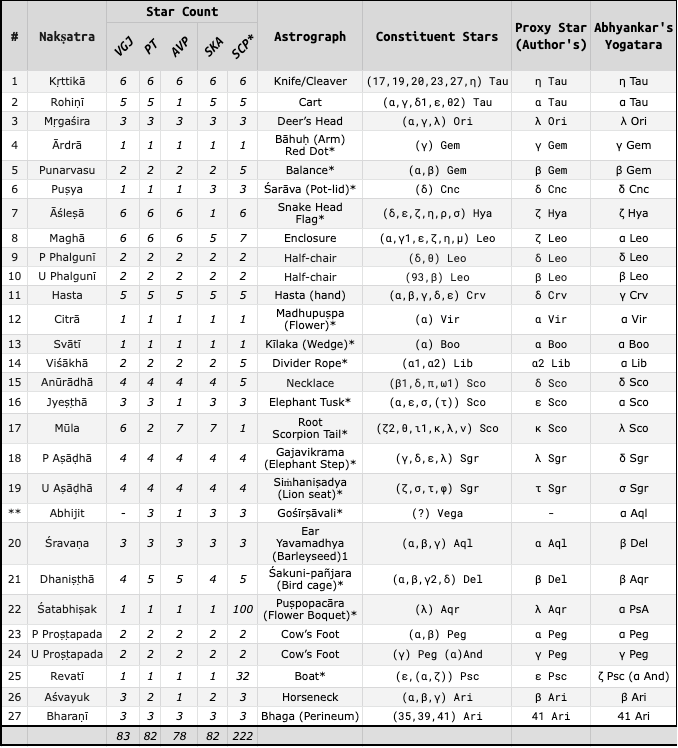
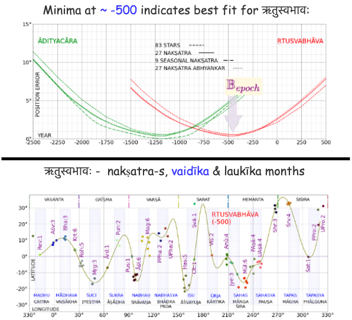

###  ज्योति: शास्त्रम्  (Astral Science)
- Starts with observations of  
	- ग्रहाः ( sun, moon and the planets) in
	- the background of ताराः (stars)
- Progresses 
	- from broad observations 
	- to finer observations of positions and movements
- Further progresses towards 
	- a computational model
  
---
##  वृद्धगार्गीयज्योतिषम् (VGJ)

- Big text ~5000 verses and some prose
- 24 अङ्गाः (sections), 40 उपाङ्गाः (extra-sections)
- CAHC has published a critical edition of 5 अध्यायाः (chapters) of 1st अङ्गः
  
#### Two VGJ chapters describe Sun Transit - focus of this talk
- **आदित्यचारः**   11th section
- **ऋतुस्वभावः**  59th section, chapters 1-6

---

## नक्षत्राणि  (asterisms) 
- Zones in the sky through which Moon, Sun and ग्रहाः travel
- Using clock analogy - **नक्षत्राणि** are the dial markings - 27(28)in all
	- The quicker hand is the Moon - one round a sidereal month
	- The slower hand is the Sun - one round a sidereal year . The Sun makes one **दक्षिणायण** (north-to-south) and one **उत्तरायण** (south-to-north) journey in a year
- Some are unambiguously identified 
	- कृत्तिका, रोहिणी, मघा, हस्ता, चित्रा,स्वाति, विशाखे, ज्येष्ठा, मूला
- Others have some ambiguity
	- आर्द्रा, श्रविष्ठा/धनिष्ठा, रेवती

---

<!--  -->

## Equinox and Precession
- **Equinox** is the midpoint of 
	- the Sun's north-to-south(दक्षिणायण) and south-to-north(उत्तरायण) journey
 -  The नक्षत्राणि dial also rotates 
	- In direction opposite to Sun/Moon hand
	- And takes ~26000 years to complete a round
	- This dial rotation is caused by **precession** of Earth's axis
- This *precession* has the following effect  
	- The नक्षत्रम् marking the seasons and equinoxes **move by 1 नक्षत्रम् every ~1000 years**
---
 

## नक्षत्राणि list 
<!--  -->

- The table shows **83 ताराः** of नक्षत्राणि 
	- each नक्षत्रम् is made of 1 or more **constituent stars**
	- Vedic, Jaina & Baudha texts - PT, VGJ, AVP, SCP, SKA provide **astrograph and count** information
	- **Proxy stars** for each नक्षत्रम् helps to model **आदी, अर्ध, अन्त** in the text

---
## आदित्यचारः (*Sun's transit*)

|Verse|From|To|ऋतु|
|:---|---|---|---|
श्रविष्ठादीनि चत्वारि पौष्णार्धञ्च दिवाकरः  ।   वर्धयन् सरसस्तिक्तं मासौ तपति **शैशिरे**  ॥ 47 | श्रविष्ठा आदी | रेवती अर्ध | शिशिर 
रोहिण्यन्तानि विचरन् पौष्णार्धाद्याच्च भानुमान् ।  मासौ तपति **वासन्तौ** कषायं वर्धयन् रसम्॥ 48 | रेवती अर्ध | रोहिणी अन्त | वसन्त
सार्पार्धान्तानि विचरन् सौम्याद्यानि तु भानुमान् ।  **ग्रैष्मिकौ** तपते मासौ कटुकं वर्धयन् रसम्॥ 52 | मृगशिरा आदी | आश्लेषा अर्ध | ग्रीष्म
सावित्रान्तानि विचरन् सार्पार्धाद्यानि भास्करः ।  **वार्षिकौ** तपते मासौ रसमम्लं विवर्धयन्॥ 53 |आश्लेषा अर्ध | हस्ता अन्त | वर्षा
चित्रादीन्यथ चत्वारि ज्येष्ठार्धञ्च दिवाकरः।  **शारदौ** लवणाख्यं च तपत्याप्याययन् रसम्॥ 54 | चित्रा आदी | ज्येष्ठा अर्ध | शरद्
ज्येष्ठार्धादीनि चत्वारि वैष्णवान्तानि भास्करः ।  **हेमन्ते** तपते मासौ मधुरं वर्धयन् रसम् ॥ 55 | ज्येष्ठा अर्ध | श्रवण अन्त | हेमन्त

- Similar information is found in the PT as prose
	- Maps each of 6 ऋतु to a span 4½ नक्षत्राणि (each of 61 days)
	- Dating of the *6 bright unabmiguous stars(:star:)* for visibility in their seasons is given in the **PT book - 1350-1130 BCE**
- An improved dating - fit below for their stated seasons
	- *9 circled seasonals(🟢) नक्षत्राणि*
	- *27 proxy stars*
	- *83 constituent stars*
	- yields **50 years around 1250 BCE** - a finer window

---

## आदित्यचारः - date estimation  
- From the text 
	- नक्षत्राणि are equally spaced at 13.33° - given seasons are of equal of 4½ नक्षत्राणि
	- शिशिर start is sun with श्रविष्ठादि taken as 270°
	- Given the नक्षत्रम् sequence and above, span of each नक्षत्रम् is obtained 
- The best fit method 
	- Get longitude of 83 stars from -2500 to 500 in 50 year epochs
	- For each epoch compute this error metric **$\mathbb{E}_{epoch}$**
	- The epoch with **lowest error metric** is the best fit **$\mathbb{B}_{epoch}$**
$$ 
\begin{aligned}
\mathbb{B}_{epoch} &= \mathop{\arg \min}\limits_{ {epoch} {} \in -2500,500,50} \mathbb{E}_{epoch} \\
\mathbb{E}_{epoch} &= \frac{1}{27}{\sum_{न=1}^{27} \frac {\sum_{त=1}^{T_{न}} err_{न,त}} {T_{न}}} \\
  err_{न,त} &= \begin{cases}
    0, & \text{if  {}  $long_{न} \lt long_{त}< long_{न+1}$}  \\ 
    else & min(\bigl| long_{त} - long_{न}\big| , | long_{त} - long_{न+1}\big|)  
  \end{cases}
\end{aligned}
$$
---

##  अभिजित, श्रवण, धनिष्ठा/श्रविष्ठा
- Winter solstice drift can be seen
	- श्रविष्ठार्धा in MAU to
	- श्रविष्ठादि in PT/VGJ 
	- towards अभिजित in MB
- At some point in the transition period
	- धनिष्ठा is named the winter solstice नक्षत्रम् 
	- अभिजित is eliminated to pack 6 ऋतु of 4½ नक्षत्राणि
	- the 27 नक्षत्राणि regime takes hold over the 28
- Validating the transition period with
	- श्रविष्ठा	as β Aqr ( श्रवण post transition ) 
	- श्रवण as β Del ( धनिष्ठा post transition ) 
	- the 9 seasonal नक्षत्राणि remain in bound from 1700-1350bce
- The 6 ऋतु system 
	- started around 1700bce with day counts and 
	- stabilized around 1300bce with 4½ नक्षत्राणि per ऋतु

---

##  ऋतुस्वभावः
- Describes Suns path through
	- 12  **वैदीक** and 
	- 12 corresponding **लौकीक** months and
	- 12 नक्षत्रम् for each of these months - ~30° apart
	- 6 seasons and their months

- This is different from आदित्यचारः
	- ऋतु sequence begins with वसन्त not शिशिर:
	- ऋतु are related to months, not नक्षत्रम् span & boundaries
	- श्रविष्ठा is past its time when शिशिरः starts, not heralding शिशिरः
	- Equinox is reckoned as mid वसन्त
	- 12 month solar calendar, obviating intercalation, emerges

---

### In closing

- ऋतु based sun transit started around -1700 with 61 day count
- आदित्यचारः observations date to about -1250 with 4½ नक्षत्राणि span 
- ऋतुस्वभावः observations date to about -500 with 12 solar months
- VGJ layered and contains information across generations of observations and inferences
- Solar transit(zodiac) is certainly part of original Indian knowledge - that has been recorded and evolved over time

<!-- ---
### From Observations to Computations

||||
|:--:|:-|:--|
|Vedic|  अथर्ववेद परिशिष्ट |*Atharvaveda-pariśiṣṭa (AVP)*|
|Vedāṅga|  पराशरतन्त्रम् |*Parāśara Tantram(PT)* |
||**व्रद्धगार्गीय ज्योतिषम्** |*Vṛddhagārgīyā Jyotiṣam (VGJ)*|
||लागधीय वेदाङ्गज्योतिषम् |*Lagadhiyā Vedāṅga Jyotiṣam (LVJ)*|
|Jain|सूर्य चन्द्र प्रज्ञप्ति |*Sūrya-candra-prajñapti (SCP)*|
|Baudha|शार्दूलकर्णावदान |*Śardūlakarṇāvadāna (SKA)*|
|Siddhānta|बृहत्संहिता |*Bṛhatsaṃhitā (BS)*| -->
