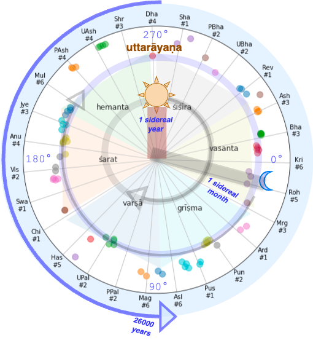
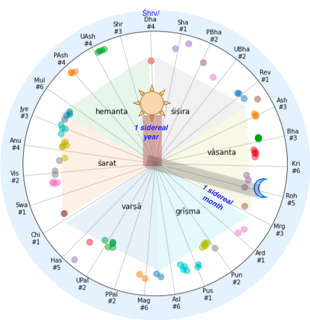
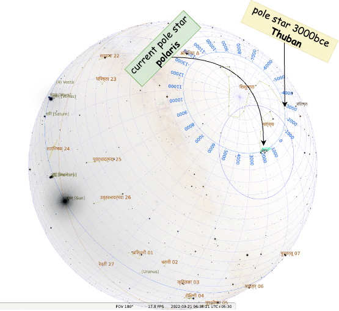
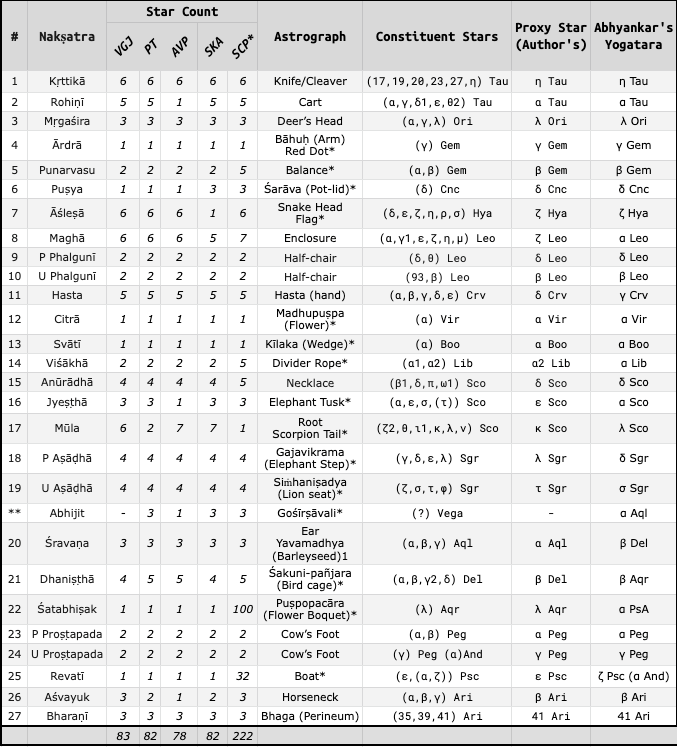
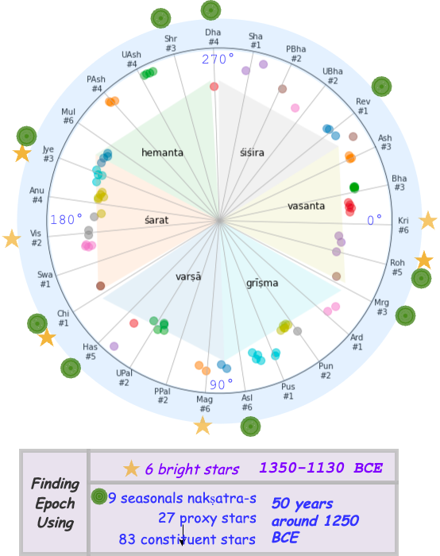
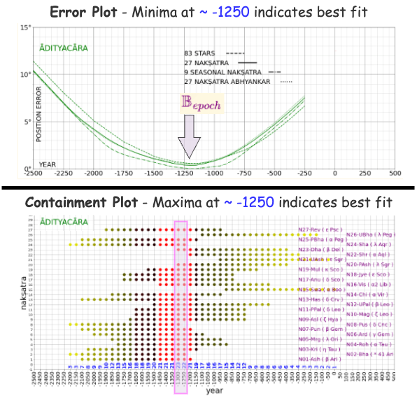
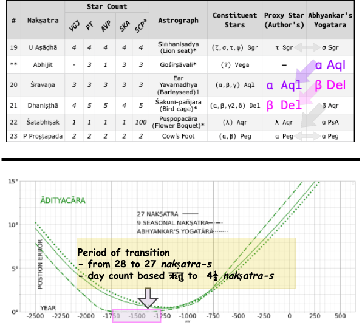
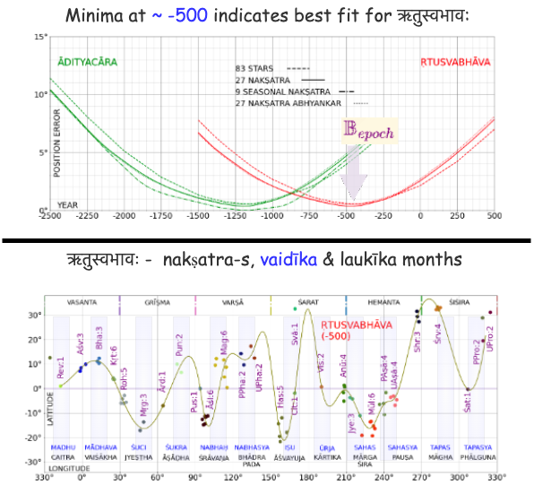

##  ज्योति: शास्त्रम्  (Astral Science)
- Starts with observations of  - sun, moon and the planets- in the background of stars
- Progresses - from broad observations to finer observations of positions and movements
- Further progresses towards a computational model

### वृद्धगार्गीयज्योतिषम् (VGJ)

- Big text ~5000 verses and some prose,  24 *aṅga-s*, 40 *upaṅga-s*
- CAHC has published a critical edition of 7 chapters from the 1st and 2nd *aṅga*

### Focus of this talk - two  **Sun Transit** chapters of VGJ
##### 1. **आदित्यचारः**   11th section
##### 2. **ऋतुस्वभावः**  59th section, chapters 1-6

<!--
- Jyotisha and phalita-jyotisha have different emphasis
- VGJ contains observations and portends 
- Observations are the focus of this talk

260170.16843869336,
625411.0695019698,
990653.9210658022,
1355896.7085281657,
1721139.4144872706,
2086382.052770633,
2451624.582630625
]
-->

---
### Sun's Annual Swing
- An observer watching every sun rise through the year will see this swing

||||||
|--|:---:|:---:|:---:|:---:|
||**uttarāyaṇa start**   (winter solstice)|vernal equinox|dakṣiṇāyana   (summer solstice)|autumn equinox|
|sun's   longitude| 270° | 0° | 90° | 180° |
- In one year, the Sun makes 
	- one ***uttarāyaṇa*** (south-to-north) and one **dakṣiṇāyana** (north-to-south) swing 
	- the extreme points are **solstices**, *winter* and *summer* respectively
	- **equinox** is the mid point of these swings - *vernal* and *autumn* equinoxes

---
## Nakṣatra-s

<!--  -->
- **Nakṣatra-s** are zones/stars on the ecliptic belt in the sky through which Moon, Sun and planets travel. They contain one or constituent stars
- Using clock analogy 
	- Nakṣatra-s are the dial markings - 27(28)in all
	- The quicker hand is the Moon - one round a sidereal month
	- The slower hand is the Sun - one round a sidereal year .
- Stars of some *nakṣatra-s* are unambiguously identified 
	- कृत्तिका, रोहिणी, मघा, हस्ता, चित्रा,स्वाति, विशाखे, ज्येष्ठा, मूला
- Others have some ambiguity
	- आर्द्रा, श्रविष्ठा/धनिष्ठा, रेवती 
<!-- - In one year, the Sun makes 
	- one **dakṣiṇāyana** (north-to-south) and 
	- one **uttarāyaṇa** (south-to-north) journey
	- **equinox** is the mid point of these journeys 
	- the **equinox while uttarāyaṇa** is taken as 0°
	- the **uttarāyaṇa start** is taken as 270°   -->

<!-- 
- Tropical year is uttyna to uttyna  365.25 days
- Sidereal year/month is Naks to Naks ( 20min shorter than 365.25 )/27.3
- Synodic month is amavasya to amavasya 29.5 
- Naks sequence has remained stable for a long duration
- Starting with कृत्तिका िन 4.4.10 of KYV, Ashwini is the current memorized sequence
- Abhijit continues to be SCP , while VGJ/PT text have dropped
- Practice to spot and identify the Naks (stars/zones) 
-->

---
## Precession
<!--  -->

- **Precession** has the following effects 
	- The *nakṣatra* marking the seasons/equinoxes **move by 1 *nakṣatra* every ~1000 years**
	- The **pole star has drifted** from *abhayadhruva* (thuban) around 3000 BCE to around *dhruva* (polaris) now
- It is caused by wobble of the earth's axis much like wobble of a spinning top.
 -  In the clock analogy precession is rotation of the *nakṣatra* dial
	- In direction opposite to Sun/Moon hand
	- And takes ~26000 years to complete a round
- Is an important phenomena to date astronomical observations
	- In our approach we precess mutiple stars to date observations to minimize errors
<!--  -->
<!--
- In this pic moon is with Rohini :)
- Eqnx defn is sun at the junction of ecliptic and equator 
- sun rise is most due east
- Precession causes equinox to drift by 1 day every 72 days -  Uttarayana drift is an example
--->

---
<!--  -->
<!--  -->

---
 ## Nakṣatra Listings

- The table shows **83 constituent stars** of the *nakṣatra-s* per VGJ
- Vedic, Jaina & Baudha texts have **astrograph and count** information
- **Proxy stars** for each *nakṣatra*, help model the **ādi, ardha, anta** ( begin, mid, end ) in the text 

- A few astrographs 

<!--
- Lists by Lahiri, Abhyankar, RNI ( largely overlap)
- Unequal treatment needs more work
-->

---
## आदित्यचारः (*Sun's transit*)

|Verse|From|To|Ṛtu|Span|
|:---|:---:|:---:|:---:|:--:|
*श्रविष्ठादीनि* चत्वारि ***पौष्णार्धञ्च*** दिवाकरः  ।   वर्धयन् सरसस्तिक्तं मासौ तपति **शैशिरे**  ॥ 47 | श्रविष्ठा begin | रेवती mid | शिशिर | 270°-330° |
***रोहिण्यन्तानि*** विचरन् *पौष्णार्धाद्याच्च* भानुमान् ।  मासौ तपति **वासन्तौ** कषायं वर्धयन् रसम्॥ 48 | रेवती mid | रोहिणी end | वसन्त|330°-30°|
***सार्पार्धान्तानि*** विचरन् *सौम्याद्यानि* तु भानुमान् ।  **ग्रैष्मिकौ** तपते मासौ कटुकं वर्धयन् रसम्॥ 52 | मृगशिरा begin | आश्लेषा mid | ग्रीष्म| 30°-90°|
***सावित्रान्तानि*** विचरन् *सार्पार्धाद्यानि* भास्करः ।  **वार्षिकौ** तपते मासौ रसमम्लं विवर्धयन्॥ 53 |आश्लेषा mid | हस्ता end | वर्षा| 90°-150°|
*चित्रादीन्यथ* चत्वारि ***ज्येष्ठार्धञ्च*** दिवाकरः।  **शारदौ** लवणाख्यं च तपत्याप्याययन् रसम्॥ 54 | चित्रा begin | ज्येष्ठा mid | शरद्|150°-210°|
*ज्येष्ठार्धादीनि* चत्वारि ***वैष्णवान्तानि*** भास्करः ।  **हेमन्ते** तपते मासौ मधुरं वर्धयन् रसम् ॥ 55 | ज्येष्ठा mid | श्रवण end | हेमन्त|210°-270°|

- Similar information is found in the PT as prose
	- Maps each of 6 ṛtu to a span 4½ *nakṣatra* ( of 61 days)
	- **PT book** dates *6 bright stars(:star:)*  to **1350-1130 BCE**, based on visibility in their stated  seasons
- An **improved dating** fits below for their stated seasons 
	- *9 circled seasonals(🟢) nakṣatra-s*
	*27 proxy stars* 
	*83 constituent stars*
	- This yields **50 years around 1250 BCE** - a finer window

---
## आदित्यचारः - date estimation  

- From the text 
	- *nakṣatra-s* are equally spaced at 13.33° - given seasons are of equal of 4½ *nakṣatra-s*
	- शिशिर start is sun with श्रविष्ठादि taken as 270°
	- Given the *nakṣatra-s* sequence and above, span of each *nakṣatra* is obtained 
- The **best fit method** finds the epoch where most stars of *nakṣatra-s* are in their prescribed span
	- Get longitude of 83 stars from -2500 to 500 in 50 year epoch steps
	- For each epoch compute this error metric **$\mathbb{E}_{epoch}$**
	- The epoch with **lowest error metric** is the best fit **$\mathbb{B}_{epoch}$**
$$ 
\begin{aligned}
\mathbb{B}_{epoch} &= \mathop{\arg \min}\limits_{ {epoch} {} \in -2500,500,50} \mathbb{E}_{epoch} \\
\mathbb{E}_{epoch} &= \frac{1}{27}{\sum_{न=1}^{27} \frac {\sum_{त=1}^{T_{न}} err_{न,त}} {T_{न}}} \\
  err_{न,त} &= \begin{cases}
    0, & \text{if  {}  $long_{न} \lt long_{त}< long_{न+1}$}  \\ 
    else & min(\bigl| long_{त} - long_{न}\big| , | long_{त} - long_{न+1}\big|)  
  \end{cases}
\end{aligned}
$$
<!-- 
- Error measures how far Naks is from its prescribed span. 
- The span is derived from Shravistadi at 270 and the naks sequence
- Stellarium scripts to scrape longitudes
- Python to crunch and plot
 -->
---
## Transition from 28 to 27 *nakṣatra-s*   ***(अभिजित् , श्रवण, धनिष्ठा/श्रविष्ठा)*** 

- Winter solstice drift can be seen
	- श्रविष्ठार्धा in  Maitrayani Aranyaka Upanishad to
	- श्रविष्ठादि in PT/VGJ 
- At some point in the transition period
	- धनिष्ठा is named the winter solstice *nakṣatra* 
	- अभिजित्  is eliminated to pack 6 ṛtu of 4½ *nakṣatra-s*
	- 27 *nakṣatra-s* equal regime takes hold for the sun
	- 28 *nakṣatra-s* unequal regime stays for the moon
- Validating the transition period with
	- श्रविष्ठा	as β Aqr, श्रवण as β Del(श्रवण/धनिष्ठा post transition) per **Abhyankar**
	- the 9 seasonal *nakṣatra-s* remain in bound from 1700-1350bce
- The 6 solar ṛtu system 
	- started ~1700 BCE with day counts and per ṛtu 
	- stabilized ~1300 BCE with 4½ *nakṣatra-s* per ṛtu

---
##  ऋतुस्वभावः

- Describes Sun's path through
	- 12  *vaidika* and equivalent *laukika* months and  12  *nakṣatra-s* for each of these months - ~30° apart
	- 6 seasons and their months

- This is different from आदित्यचारः
	- Ṛtu sequence begins with वसन्त not शिशिर
	- Ṛtu are related to months, not  *nakṣatra* span & boundaries
	- श्रविष्ठा is past its time when शिशिर starts, not heralding शिशिर
	- A 12 month **solar zodiac**, obviating intercalation, emerges

<!-- 
- 
 -->
---

## In closing

- **2 Ayana/6 Ṛtu** based sun transit conceptualized earlier - ~ 1700 BCE 
- **VGJ/आदित्यचारः** observations date to  ~*1250 BCE* with *4½ nakṣatra-s* span per season
- **VGJ/ऋतुस्वभावः** observations date to ~*500 BCE* with *12 solar months*
- **VGJ is layered** and contains information across generations of observations and inferences
- **Solar zodiac** is certainly part of original Indian knowledge - that has been recorded and evolved over time

<!-- ---
- The Chaitradi month names are used for solar months
- The months names closely map with sun's naks of the opposite season
- We can surmise that the month name is derived from full moon naks 
### From Observations to Computations

||||
|:--:|:-|:--|
|Vedic|  अथर्ववेद परिशिष्ट |*Atharvaveda-pariśiṣṭa (AVP)*|
|Vedāṅga|  पराशरतन्त्रम् |*Parāśara Tantram(PT)* |
||**व्रद्धगार्गीय ज्योतिषम्** |*Vṛddhagārgīyā Jyotiṣam (VGJ)*|
||लागधीय वेदाङ्गज्योतिषम् |*Lagadhiyā Vedāṅga Jyotiṣam (LVJ)*|
|Jain|सूर्य चन्द्र प्रज्ञप्ति |*Sūrya-candra-prajñapti (SCP)*|
|Baudha|शार्दूलकर्णावदान |*Śardūlakarṇāvadāna (SKA)*|
|Siddhānta|बृहत्संहिता |*Bṛhatsaṃhitā (BS)*| -->
