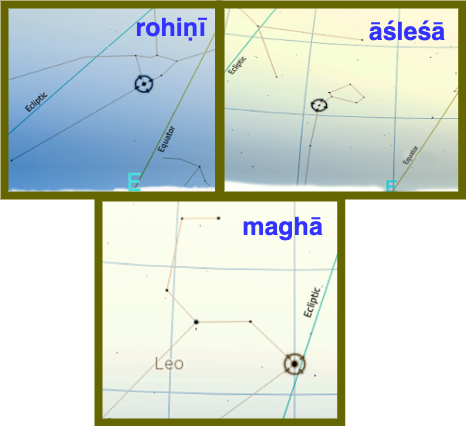

##  ज्योति: शास्त्रम्  (Astral Science)
- Starts with observations of  - sun, moon and the planets- in the background of stars
- Progresses - from broad observations to finer observations of positions and movements
- Further progresses towards a computational model

### वृद्धगार्गीयज्योतिषम् (VGJ)

- Big text ~5000 verses and some prose,  24 *aṅga-s*, 40 *upaṅga-s*
- CAHC has published a critical edition of 5 chapters of 1st *aṅga*

### Focus of this talk - two  **Sun Transit** chapters of VGJ
##### 1. **आदित्यचारः**   11th section
##### 2. **ऋतुस्वभावः**  59th section, chapters 1-6

<!--
- Jyotisha and phalita-jyotisha have different emphasis
- VGJ contains observations and portends 
- Observations are the focus of this talk
-->

---
## Nakṣatra-s

- Zones in the sky through which Moon, Sun and planets travel
- Using clock analogy - nakṣatra-s are the dial markings - 27(28)in all
	- The quicker hand is the Moon - one round a sidereal month
	- The slower hand is the Sun - one round a sidereal year . In one year, the Sun makes 
		- one **dakṣiṇāyana** (north-to-south) and 
		- one **uttarāyaṇa** (south-to-north) journey 
- Some *nakṣatra-s* are unambiguously identified 
	- कृत्तिका, रोहिणी, मघा, हस्ता, चित्रा,स्वाति, विशाखे, ज्येष्ठा, मूला
- Others have some ambiguity
	- आर्द्रा, श्रविष्ठा/धनिष्ठा, रेवती

<!-- 
- Tropical year is uttyna to uttyna  365.25 days
- Sidereal year/month is Naks to Naks ( 20min shorter than 365.25 )/27.3
- Synodic month is amavasya to amavasya 29.5 
- Naks sequence has remained stable for a long duration
- Starting with कृत्तिका िन 4.4.10 of KYV, Ashwini is the current memorized sequence
- Abhijit continues to be SCP , while VGJ/PT text have dropped
- Practice to spot and identify the Naks (stars/zones) 
-->

---
## Equinox & Precession

- **Equinox** is the midpoint of 
	- The sun's *dakṣiṇāyana* & *uttarāyaṇa* journeys
 -  **Precession** - The *nakṣatra* dial also rotates 
	- In direction opposite to Sun/Moon hand
	- And takes ~26000 years to complete a round
- This precession has the following effects 
	- The *nakṣatra* marking the seasons/equinoxes **move by 1 *nakṣatra* every ~1000 years**
	- the pole drifts from *abhayadhruva* (thuban) around -3000 to around *dhruva* (polaris) now

<!--
- In this pic moon is with Rohini :)
- Eqnx defn is sun at the junction of ecliptic and equator 
- sun rise is most due east
- Precession causes equinox to drift by 1 day every 72 days -  Uttarayana drift is an example
--->
---
 ## Nakṣatra Listings

- The table shows **83 stars** of the *nakṣatra-s*
- each *nakṣatra* has 1 or more **constituent stars**
- Vedic, Jaina & Baudha texts have **astrograph and count** information
- **Proxy stars** for each *nakṣatra* help model **आदी, अर्ध, अन्त** in the text 
	 
<!--
- Lists by Lahiri, Abhyankar, RNI ( largely overlap)
- Unequal treatment needs more work
-->

---
## आदित्यचारः (*Sun's transit*)

|Verse|From|To|ऋतु|
|:---|---|---|---|
श्रविष्ठादीनि चत्वारि पौष्णार्धञ्च दिवाकरः  ।   वर्धयन् सरसस्तिक्तं मासौ तपति **शैशिरे**  ॥ 47 | श्रविष्ठा आदी | रेवती अर्ध | शिशिर 
रोहिण्यन्तानि विचरन् पौष्णार्धाद्याच्च भानुमान् ।  मासौ तपति **वासन्तौ** कषायं वर्धयन् रसम्॥ 48 | रेवती अर्ध | रोहिणी अन्त | वसन्त
सार्पार्धान्तानि विचरन् सौम्याद्यानि तु भानुमान् ।  **ग्रैष्मिकौ** तपते मासौ कटुकं वर्धयन् रसम्॥ 52 | मृगशिरा आदी | आश्लेषा अर्ध | ग्रीष्म
सावित्रान्तानि विचरन् सार्पार्धाद्यानि भास्करः ।  **वार्षिकौ** तपते मासौ रसमम्लं विवर्धयन्॥ 53 |आश्लेषा अर्ध | हस्ता अन्त | वर्षा
चित्रादीन्यथ चत्वारि ज्येष्ठार्धञ्च दिवाकरः।  **शारदौ** लवणाख्यं च तपत्याप्याययन् रसम्॥ 54 | चित्रा आदी | ज्येष्ठा अर्ध | शरद्
ज्येष्ठार्धादीनि चत्वारि वैष्णवान्तानि भास्करः ।  **हेमन्ते** तपते मासौ मधुरं वर्धयन् रसम् ॥ 55 | ज्येष्ठा अर्ध | श्रवण अन्त | हेमन्त

- Similar information is found in the PT as prose
	- Maps each of 6 ऋतु to a span 4½ *nakṣatra* ( of 61 days)
	- **PT book** dates *6 bright stars(:star:)*  to **1350-1130 BCE**, based on visibility in their stated  seasons
- An **improved dating** fits below for their stated seasons 
	- *9 circled seasonals(🟢) nakṣatra-s*
	*27 proxy stars* 
	*83 constituent stars*
	- This yields **50 years around 1250 BCE** - a finer window

---
## आदित्यचारः - date estimation  

- From the text 
	- *nakṣatra-s* are equally spaced at 13.33° - given seasons are of equal of 4½ *nakṣatra-s*
	- शिशिर start is sun with श्रविष्ठादि taken as 270°
	- Given the *nakṣatra-s* sequence and above, span of each *nakṣatra* is obtained 
- The **best fit method** finds the epoch where most *nakṣatra-s* are in their prescribed span
	- Get longitude of 83 stars from -2500 to 500 in 50 year epoch steps
	- For each epoch compute this error metric **$\mathbb{E}_{epoch}$**
	- The epoch with **lowest error metric** is the best fit **$\mathbb{B}_{epoch}$**
$$ 
\begin{aligned}
\mathbb{B}_{epoch} &= \mathop{\arg \min}\limits_{ {epoch} {} \in -2500,500,50} \mathbb{E}_{epoch} \\
\mathbb{E}_{epoch} &= \frac{1}{27}{\sum_{न=1}^{27} \frac {\sum_{त=1}^{T_{न}} err_{न,त}} {T_{न}}} \\
  err_{न,त} &= \begin{cases}
    0, & \text{if  {}  $long_{न} \lt long_{त}< long_{न+1}$}  \\ 
    else & min(\bigl| long_{त} - long_{न}\big| , | long_{त} - long_{न+1}\big|)  
  \end{cases}
\end{aligned}
$$
<!-- 
- Error measures how far Naks is from its prescribed span. 
- The span is derived from Shravistadi at 270 and the naks sequence
- Stellarium scripts to scrape longitudes
- Python to crunch and plot
 -->
---
## Transition from 28 to 27 *nakṣatra-s*   ***(अभिजित, श्रवण, धनिष्ठा/श्रविष्ठा)*** 

- Winter solstice drift can be seen
	- श्रविष्ठार्धा in MAU to
	- श्रविष्ठादि in PT/VGJ 
	- towards अभिजित in MB
- At some point in the transition period
	- धनिष्ठा is named the winter solstice *nakṣatra* 
	- अभिजित is eliminated to pack 6 ऋतु of 4½ *nakṣatra-s*
	- the 27 नक्षत्राणि regime takes hold over the 28
- Validating the transition period with
	- श्रविष्ठा	as β Aqr ( श्रवण post transition ) 
	- श्रवण as β Del ( धनिष्ठा post transition ) 
	- the 9 seasonal *nakṣatra-s* remain in bound from 1700-1350bce
- The 6 ऋतु system 
	- started around 1700 BCE with day counts and 
	- stabilized around 1300 BCE with 4½ *nakṣatra-s* per ऋतु

---
##  ऋतुस्वभावः

- Describes Suns path through
	- 12  *vaidīka* and   
	- 12 corresponding *laukīka* months and
	- 12  *nakṣatra-s* for each of these months - ~30° apart
	- 6 seasons and their months

- This is different from आदित्यचारः
	- ऋतु sequence begins with वसन्त not शिशिर
	- ऋतु are related to months, not  *nakṣatra* span & boundaries
	- श्रविष्ठा is past its time when शिशिर starts, not heralding शिशिर
	- Equinox is reckoned as mid वसन्त
	- A 12 month solar calendar, obviating intercalation, emerges

<!-- 
- 
 -->
---

## In closing

- ऋतु based sun transit started around -1700 with 61 day count
- आदित्यचारः observations date to about -1250 with 4½ *nakṣatra-s* span per season
- ऋतुस्वभावः observations date to about -500 with 12 solar months
- VGJ is layered and contains information across generations of observations and inferences
- Solar transit (zodiac) is certainly part of original Indian knowledge - that has been recorded and evolved over time

<!-- ---
- The Chaitradi month names are used for solar months
- The months names closely map with sun's naks of the opposite season
- We can surmise that the month name is derived from full moon naks 
### From Observations to Computations

||||
|:--:|:-|:--|
|Vedic|  अथर्ववेद परिशिष्ट |*Atharvaveda-pariśiṣṭa (AVP)*|
|Vedāṅga|  पराशरतन्त्रम् |*Parāśara Tantram(PT)* |
||**व्रद्धगार्गीय ज्योतिषम्** |*Vṛddhagārgīyā Jyotiṣam (VGJ)*|
||लागधीय वेदाङ्गज्योतिषम् |*Lagadhiyā Vedāṅga Jyotiṣam (LVJ)*|
|Jain|सूर्य चन्द्र प्रज्ञप्ति |*Sūrya-candra-prajñapti (SCP)*|
|Baudha|शार्दूलकर्णावदान |*Śardūlakarṇāvadāna (SKA)*|
|Siddhānta|बृहत्संहिता |*Bṛhatsaṃhitā (BS)*| -->
